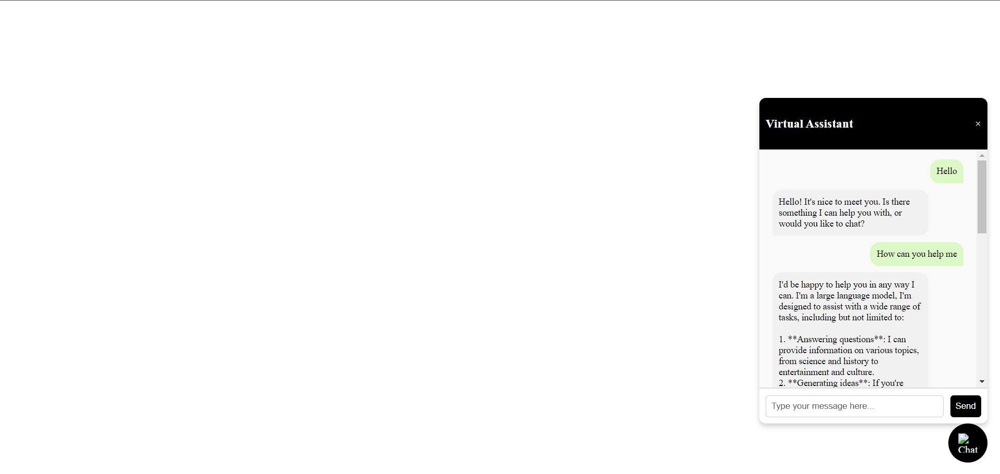

# Website AI Chat Bot
   

A website AI virtual assistant built using HTML, CSS, JavaScript, and Python (Flask). This chat bot leverages Groq API to utilize Llama 3 8B, providing an interactive experience directly on your website.

## Features
- Seamless integration with websites
- Natural language processing with Groq API and Llama 3 8B
- Customizable frontend for seamless user interaction

## Screenshots


## Requirements
Ensure you have the following prerequisites installed:

- Python 3.8+
- Flask
- Groq API access (to use Llama 3 8B)
- Basic HTML, CSS, and JavaScript knowledge to tweak the frontend

## Installation

1. Clone the repository:

   ```bash
   git clone https://github.com/uditya2004/WebsiteAIChatBot.git
   cd WebsiteAIChatBot
   ```

2. Create and activate a virtual environment:

   **Linux/macOS:**
   ```bash
   python3 -m venv venv
   source venv/bin/activate
   ```
   **Windows:**
   ```bash
   python -m venv venv
   venv\Scripts\activate
   ```

3. Install required dependencies:

   ```bash
   pip install -r requirements.txt
   ```

4. Set up the environment variables:

   - Create a `.env` file in the root directory.
   - Add the required configuration for the Groq API key, for example:
     ```
     GROQ_API_KEY=your_groq_api_key_here
     ```

5. Run the Flask application:

   ```bash
   flask run
   ```

6. Open a browser and go to `http://127.0.0.1:5000/` to see the AI Chat Bot in action.

## Project Structure
```
WebsiteAIChatBot/
|├── templates/           # HTML files for the frontend
|├── venv/               # Virtual environment
|├── .env                # Environment variables (API keys, etc.)
|├── README.md            # Project documentation
|├── app.py              # Flask backend for handling chat bot
|├── chat-icon.jpg       # Icon for the chatbot
|├── requirements.txt    # Python dependencies
|├── scripts.js          # JavaScript for chatbot interaction
|├── styles.css          # CSS for styling
```

## Usage

- The bot can be customized to handle various types of user inquiries depending on your requirements.
- Modify `scripts.js` and `styles.css` to adjust the look and feel of the bot as per your preferences.
- Update the templates within the `templates` folder to tweak the UI/UX.

## Technologies Used

- **Frontend**: HTML, CSS, JavaScript
- **Backend**: Flask (Python)
- **AI Model**: Llama 3 8B via [Groq API](https://groq.com/)

## How It Works

- The frontend, built using HTML, CSS, and JavaScript, provides a chat interface for users.
- User messages are sent to the backend (Flask app) where they are processed using the Groq API to access the Llama 3 8B model.
- Responses are then sent back to the user, providing an interactive and intelligent conversation experience.

## Contributions

Feel free to contribute! If you want to enhance the features or fix any bugs, just create a pull request.

## Contact

If you have any questions or suggestions, feel free to reach out:
- **GitHub**: [uditya2004](https://github.com/uditya2004)

## Acknowledgements

Special thanks to the creators of Llama 3 and Groq API for their powerful AI capabilities.

